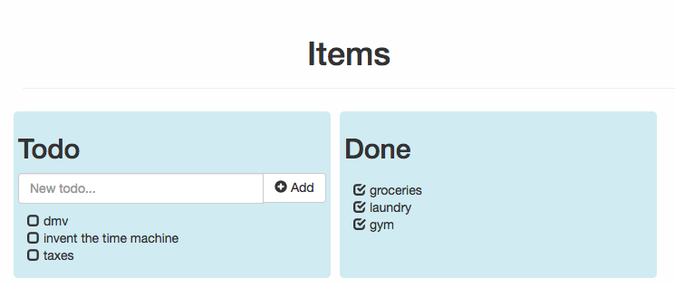
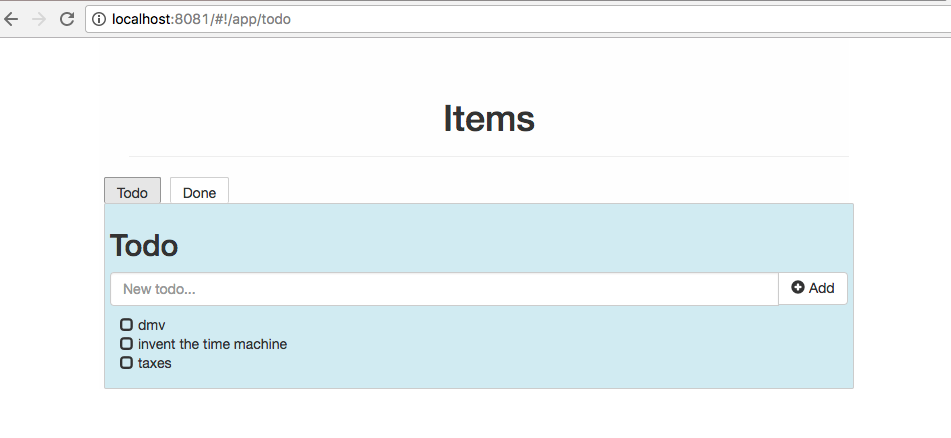
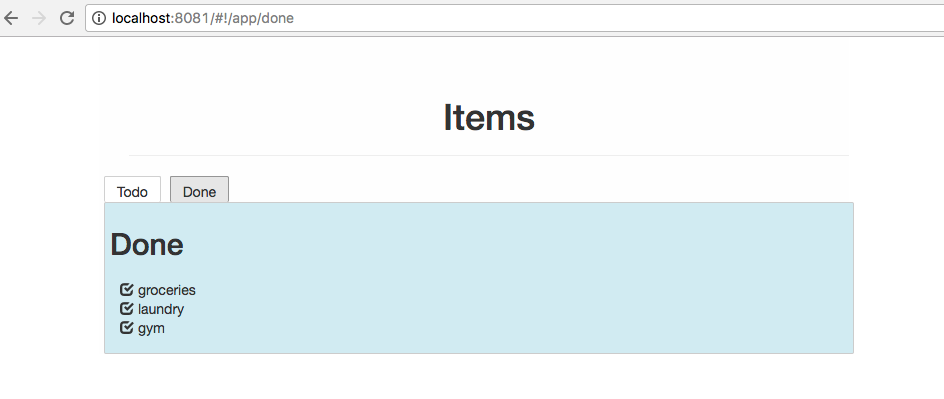

# ReachLocal Interview App
After you have completed the exercises below, create a Pull Request(PR) to the **master branch** and assign it to @rhidek, @dewayania, and @mkgit007 .

### Backend/FullStack Engineer
These exercises are to be completed by both Backend and FullStack candidates.
1. Update the REST Todos resource to support creating a new Todo. Add the following constraints:
   * Max 10 Todos
   * Max size of 200 characters per Todo
   * No duplicate Todos allowed (case insensitive)
1. Update the REST Todos resource to support deleting a Todo.
1. In the description section of your PR, explain:
   * How would you change this app to support multiple users?
   * How would you handle errors?

### Frontend/FullStack Engineer
These exercises are to be completed by both Frontend and FullStack candidates.
1. Add support for deleting a Todo.
   * should call the DELETE method on /todos/:todoId (not to be implemented on backend unless you are FullStack)
1. Add a warning popover for when the backend can't be reached.
1. In the description section of your PR, explain:
   * How would you change this app to support multiple users?

### Frontend Engineer
These exercises are to be completed by Frontend candidates. These exercises are optional for FullStack candidates.
1. Add a Done section to the app.
   * Add support for marking a Todo as completed.
   * A Todo marked as completed should be removed from the Todo list.
   * Completed Todos should be visible in the Done list.

   

1. In a separate commit, create two tabs for the app: Todo, Done.
   * If the Todo tab is selected, the Todo list should be shown, and the Done list should not be shown. If the Done tab is selected, the Done list should be shown, and the Todo list should not be shown.
   * If the Todo tab is selected, the url should be updated to localhost:8080/app/todo. If the Done tab is selected, the url should be udpated to localhost:8080/app/done.
   * If you open a new tab and enter localhost:8080/app/todo in the url, you should be taken directly to the Todo tab. If you open a new tab and enter localhost:8080/app/done in the url, you should be taken directly to the Done tab.

   
   
   

## Setup
### Tools
* install [NVM](https://github.com/creationix/nvm)
  * make sure the path to npm is in your PATH environment variable
* install node 8.8.1
  * nvm install 8.8.1
* install [Java 8 SDK](http://www.oracle.com/technetwork/java/javase/downloads/jdk8-downloads-2133151.html)

### Clone the project
* clone the project to your local machine
  * HTTPS:
    * git clone https://github.com/**yourUsername**/interview-**yourUsername**.git
  * SSH:
    * git clone git@github.com:**yourUsername**/interview-**yourUsername**.git

### Run the java project
* cd <todo project dir>
* ./gradlew bootRun

### Run just the UI
* cd ./client
* run _npm install_
* npm run serve

### Test the UI
* npm test
